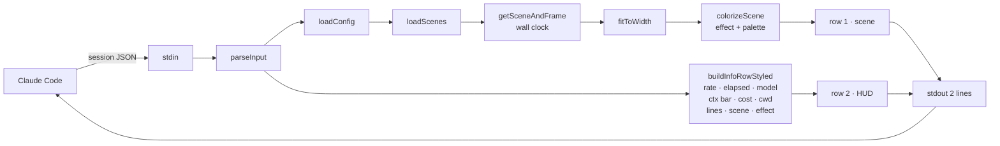
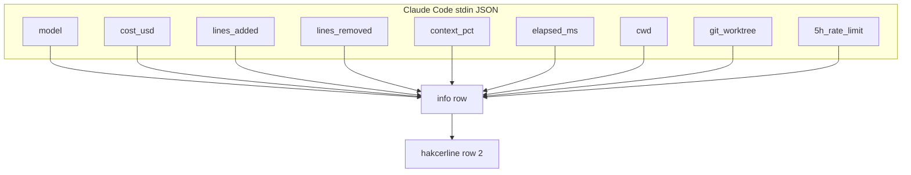

```
 ▓▓▓▓▓▓▓▓▓▓▓▓▓▓▓▓▓▓▓▓▓▓▓▓▓▓▓▓▓▓▓▓▓▓▓▓▓▓▓▓▓▓▓▓▓▓▓▓▓▓▓▓▓▓▓▓▓▓▓▓▓▓▓▓▓▓▓▓▓▓▓▓▓▓▓▓▓▓▓▓▓▓▓▓▓▓▓▓▓▓▓▓▓▓▓▓▓▓▓▓▓▓▓▓▓▓
 ▓                                                                                                           ▓
 ▓     h a k c e r l i n e   //   animated statusline for Claude Code · v0.3.0 · release: 2026-04-17         ▓
 ▓     47 themed scenes · 7 color palettes · 5 TTE effects · live controls · 0 runtime deps                  ▓
 ▓                                                                                                           ▓
 ▓▓▓▓▓▓▓▓▓▓▓▓▓▓▓▓▓▓▓▓▓▓▓▓▓▓▓▓▓▓▓▓▓▓▓▓▓▓▓▓▓▓▓▓▓▓▓▓▓▓▓▓▓▓▓▓▓▓▓▓▓▓▓▓▓▓▓▓▓▓▓▓▓▓▓▓▓▓▓▓▓▓▓▓▓▓▓▓▓▓▓▓▓▓▓▓▓▓▓▓▓▓▓▓▓▓
```

# hakcerline


[](https://www.npmjs.com/package/hakcerline)
[](https://www.npmjs.com/package/hakcerline)
[](https://nodejs.org)
[](LICENSE)
[](https://github.com/haKC-ai/hakcerline)
[](https://github.com/haKC-ai/hakcerline/issues)
[](https://docs.anthropic.com/claude/docs/claude-code)
[](https://www.npmjs.com/package/ccusage)
[](scenes/)
[](package.json)
[](https://seckc.org)

Two-row animated statusline for **Claude Code**. Top row cycles through 47 themed scenes — hexdumps, WarGames, BBS login prompts, `nmap` sweeps, AOHell, DEFCON levels, Sub7, ICQ, SecKC meetup nights — each with per-character TTE color effects. Bottom row is your session HUD: model, cost, context window, elapsed time, code delta, rate limits, and live controls.

```
 0xdead1050  69 16 45 b1 8e ed ec 34  48 e7 f0 f0 0b a5 52 fb  |i.E....4H.....R.|
  8% ✳  11m16s ✳ Opus 4.6 ✳ █░░░░░░░ 16% ✳ $0.19 ✳  personal/hakcerline ✳ +0/-0 ✳ [e]Hexdump [t]wave /hakcerline
```

Pre-rendered. Stateless. Reads stdin, prints two lines, exits.

---

## install

```bash
npm install -g hakcerline
hakcerline install
```

This writes the `statusLine` block to `~/.claude/settings.json`. Restart Claude Code and the top of the terminal starts moving.

Remove it:
```bash
hakcerline uninstall
```

---

## what you get

**Row 1** — animated scene with per-character color effects (wave, rain, decrypt, sparkle, beams), cycling through 7 gradient palettes

**Row 2** — session HUD:

```
  2% ✳  7m30s ✳ Opus 4.6 ✳ ███░░░░░ 38% ✳ $2.47 ✳  personal/myproj ✳ +186/-42 ✳ [e]Hexdump [t]sparkle /hakcerline
```

| segment | glyph | what | color |
|---|---|---|---|
| rate limit |  | 5h usage % | cyan → amber → red |
| elapsed |  | session time | dark cyan |
| model | | model name | bright cyan bold |
| context | █░ | token window usage | blue → amber → red |
| cost |  | session cost | teal |
| cwd |  | working dir (last 2 segments) | aqua |
| lines | +/- | code added/removed | green / red |
| scene | [e] | current scene name | pink |
| effect | [t] | current color effect | themed |
| help | | slash command hint | dim |

Context bar and rate limit shift from cool to warm as they fill — you'll notice when things get hot.

---

## live controls

Change theme, effect, or pause animation without leaving Claude Code:

```bash
hakcerline theme fire          # or: hakcerline t fire
hakcerline effect sparkle      # or: hakcerline e sparkle
hakcerline pause               # or: hakcerline p
hakcerline hide                # or: hakcerline h
hakcerline status              # show current config
hakcerline duration 60         # scene rotation speed
```

### Claude Code slash commands

Type these right in the Claude Code prompt:

```
/hakcerline t synthwave
/hakcerline e wave
/hakcerline status
/hakcerline-help
```

Changes take effect on the next tick. Config persists in `~/.config/hakcerline/config.json`.

---

## themes

7 gradient palettes, ported from the [terminaltexteffects](https://pypi.org/project/terminaltexteffects/) spec:

| theme | vibe |
|---|---|
| `random` | cycles through all palettes (default) |
| `cyan_blue` | cold recon · bright cyan to deep blue |
| `purple_pink` | synthwave · purple to hot pink |
| `green_cyan` | matrix · forest to cyan |
| `fire` | red → orange → yellow → white |
| `ocean` | deep navy to bright cyan |
| `synthwave` | pink → purple → blue → purple → pink |
| `matrix` | green → yellow → green |

## effects

5 per-character color animations, applied to the scene row:

| effect | what it does |
|---|---|
| `wave` | gradient scrolls across the line |
| `rain` | random bright flashes over dim base |
| `decrypt` | characters reveal progressively from scrambled |
| `sparkle` | random highlights shimmer over shifting gradient |
| `beams` | light beam sweeps left to right |
| `auto` | cycles effect per scene (default) |

---

## the 47 scenes

| pack | count | what's in it |
|---|---|---|
| `core` | 7 | matrix_rain · wargames · nmap_sweep · bbs_login · packet_race · jp_fence · hacker_typer |
| `infosec` | 10 | traceroute · wardialer · sine_scroller · irc_channel · hexdump · ssh_brute · dns_exfil · enigma · defcon_level · metasploit |
| `oldschool` | 10 | blue_box · warez_nfo · l0phtcrack · morris_worm · cdc_bo · phrack · red_box · sub7 · manifesto · mitnick |
| `aol` | 10 | aohell · aol_chatroom · lord · tradewars · mud_session · icq · aim · napster · mirc_xdcc · winnuke |
| `seckc` | 10 | meetup_night · schedule · cyberraid0 · badge_pirates · seckcoin · discord · venue_history · talks · rexkc · stitches |

---

## testimonials (totally real)

> "Finally a statusline that understands me. I pressed Enter and a blue box played a 2600Hz tone. My phreak ancestors wept."
> — `anon`, somewhere with a payphone

> "The DEFCON scene cycled to DEFCON 1 during a prod incident. Spooky. Shipped the fix anyway."
> — SRE, regrets nothing

> "My intern thought `hakcerline` was an exploit kit. I let them think that."
> — red team lead

> "Works on my BBS."
> — sysop, WWIV user

---

## config

`~/.config/hakcerline/config.json`:

```json
{
  "packs": ["all"],
  "duration": 30,
  "theme": "random",
  "effect": null,
  "paused": false,
  "customScenesDir": "~/.config/hakcerline/scenes",
  "exclude": [],
  "only": null
}
```

| field | default | what it does |
|---|---|---|
| `packs` | `["all"]` | `core`, `infosec`, `oldschool`, `aol`, `seckc`, `all` |
| `duration` | `30` | seconds per scene before cycling |
| `theme` | `random` | color palette: `random`, `cyan_blue`, `purple_pink`, `green_cyan`, `fire`, `ocean`, `synthwave`, `matrix` |
| `effect` | `null` | lock effect: `wave`, `rain`, `decrypt`, `sparkle`, `beams`, or `null` for auto |
| `paused` | `false` | freeze the scene row |
| `customScenesDir` | `null` | extra directory with your own scene JSONs |
| `exclude` | `[]` | scene IDs to skip |
| `only` | `null` | if set, only run these scene IDs |

---

## custom scenes

Drop JSON files in `~/.config/hakcerline/scenes/`. They join rotation automatically.

```json
{
  "id": "custom_my_corp",
  "name": "My Corp",
  "pack": "custom",
  "frames": [
    " ACME Corp | Jenkins: 47 passing | Prod: healthy | On-call: nobody (good luck)",
    " ACME Corp | Jenkins: 46 passing 1 FAILING | Prod: DEGRADED | On-call: you (lol)"
  ]
}
```

Frames are pre-rendered strings, ~120 chars wide, any length array. Runtime pads/truncates to your terminal width.

---

## how it works



### data the info row reads



---

## prior art & acks

- **[`ccusage`](https://www.npmjs.com/package/ccusage)** — the Claude Code cost/rate tracker. The info row reads the same stdin JSON shape `ccusage` exposes. If you want numbers without scenery, use `ccusage` directly.
- **[`terminaltexteffects`](https://pypi.org/project/terminaltexteffects/)** — the TTE pip module. The 5 color effects (wave, rain, decrypt, sparkle, beams) and 7 gradient palettes are ported from TTE to pure TypeScript with zero runtime deps.
- **`hakcer`** — the terminal ASCII bling pip module that inspired this one. Different surface area, same spirit.

---

## license

MIT. Use it. Fork it. Ship custom scene packs for your company's on-call dashboard. Send them back as a PR if they're good.

---

## GREETZ

SecKC · Badge Pirates · 2600Hz crew · every sysop who ever kicked a lamer for asking `/who` twice · PHRACK · CCC · the ghost of `bo2k` · everyone still typing at 300 baud in their heart

```
   ▀▄ GREETZ also go out to /dev/null, which never said a word but listened every time ▄▀
```
