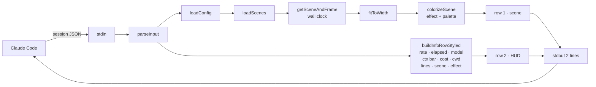

```
 ▓▓▓▓▓▓▓▓▓▓▓▓▓▓▓▓▓▓▓▓▓▓▓▓▓▓▓▓▓▓▓▓▓▓▓▓▓▓▓▓▓▓▓▓▓▓▓▓▓▓▓▓▓▓▓▓▓▓▓▓▓▓▓▓▓▓▓▓▓▓▓▓▓▓▓▓▓▓▓▓▓▓▓▓▓▓▓▓▓▓▓▓▓▓▓▓▓▓▓▓▓▓▓▓▓▓
 ▓                                                                                                           ▓
 ▓     h a k c e r l i n e   //   animated statusline for Claude Code · v0.4.0 · release: 2026-04-17         ▓
 ▓     47 themed scenes · 13 color palettes · 10 effects · live controls · 0 runtime deps                    ▓
 ▓                                                                                                           ▓
 ▓▓▓▓▓▓▓▓▓▓▓▓▓▓▓▓▓▓▓▓▓▓▓▓▓▓▓▓▓▓▓▓▓▓▓▓▓▓▓▓▓▓▓▓▓▓▓▓▓▓▓▓▓▓▓▓▓▓▓▓▓▓▓▓▓▓▓▓▓▓▓▓▓▓▓▓▓▓▓▓▓▓▓▓▓▓▓▓▓▓▓▓▓▓▓▓▓▓▓▓▓▓▓▓▓▓
```

# hakcerline


[](https://www.npmjs.com/package/hakcerline)
[](https://www.npmjs.com/package/hakcerline)
[](https://nodejs.org)
[](LICENSE)
[](https://github.com/haKC-ai/hakcerline)
[](https://github.com/haKC-ai/hakcerline/issues)
[](https://docs.anthropic.com/claude/docs/claude-code)
[](https://www.npmjs.com/package/ccusage)
[](scenes/)
[](package.json)
[](https://seckc.org)

Two-row animated statusline for **Claude Code**. Top row shows themed scenes — hexdumps, WarGames, BBS login prompts, nmap sweeps, AOHell, DEFCON levels, Sub7, ICQ, SecKC meetup nights — with smooth color gradients that sweep across static text. Bottom row is your session HUD: model, cost, context window, elapsed time, code delta, rate limits, and live controls.

```
 nmap ▸ 22/tcp open ssh  80/tcp open http  443/tcp open https ── ◐ scanning
  8% ✳  11m16s ✳ Opus 4.6 ✳ █░░░░░░░ 16% ✳ $0.19 ✳  personal/hakcerline ✳ +0/-0 ✳ [e]Nmap Sweep [t]glow /hakcerline
```

Pre-rendered. Stateless. Reads stdin, prints two lines, exits.

---

## install

```bash
npm install -g hakcerline
hakcerline install
```

This writes the `statusLine` block to `~/.claude/settings.json`. Restart Claude Code and the top of the terminal starts moving.

Remove it:
```bash
hakcerline uninstall
```

---

## what you get

**Row 1** — themed scene with color gradient animation. Text stays still, colors sweep across it at 1fps. Scenes rotate every 30 seconds by default.

**Row 2** — session HUD:

```
  2% ✳  7m30s ✳ Opus 4.6 ✳ ███░░░░░ 38% ✳ $2.47 ✳  personal/myproj ✳ +186/-42 ✳ [e]Hexdump [t]glow /hakcerline
```

| segment | what | color |
|---|---|---|
| rate limit | 5h usage % | cyan to amber to red |
| elapsed | session time | dark cyan |
| model | model name | bright cyan bold |
| context | token window bar | blue to amber to red |
| cost | session cost USD | teal |
| cwd | working dir | aqua |
| lines | code added/removed | green / red |
| scene | current scene [e] | pink |
| effect | current effect [t] | themed |
| help | /hakcerline hint | dim |

Context bar and rate limit shift from cool to warm as they fill.

---

## live controls

Change theme, effect, or pause without leaving Claude Code:

```bash
hakcerline theme frost         # or: hakcerline t frost
hakcerline effect glow         # or: hakcerline e glow
hakcerline pause               # or: hakcerline p
hakcerline hide                # or: hakcerline h
hakcerline status              # show current config
hakcerline duration 60         # scene rotation speed
```

### Claude Code slash commands

Type these right in the Claude Code prompt:

```
/hakcerline t synthwave
/hakcerline e clean
/hakcerline status
/hakcerline-help
/hakcerline-hack metasploit reverse shell   ← generate a new scene from a prompt
```

Changes take effect on the next tick. Config persists in `~/.config/hakcerline/config.json`.

---

## themes

13 gradient palettes. 7 vivid, 6 muted:

| theme | vibe |
|---|---|
| `random` | cycles through all (default) |
| `cyan_blue` | cold recon, bright cyan to deep blue |
| `purple_pink` | synthwave, purple to hot pink |
| `green_cyan` | matrix, forest to cyan |
| `fire` | red to orange to yellow to white |
| `ocean` | deep navy to bright cyan |
| `synthwave` | pink to purple to blue to purple |
| `matrix` | green to yellow to green |
| `mono` | clean grayscale, white to gray |
| `ember` | dark muted reds, burnt orange |
| `frost` | pale icy blues and whites |
| `steel` | cool grays, barely-there blue tint |
| `amber` | warm gold and honey tones |
| `dusk` | muted purple-blue twilight |

## effects

10 per-character color effects:

| effect | what it does |
|---|---|
| `glow` | bold brightened gradient (default) |
| `clean` | static palette gradient, zero animation |
| `solid` | single color from palette midpoint |
| `wave` | gradient scrolls across the line |
| `rain` | random bright flashes over dim base |
| `decrypt` | characters reveal progressively from scrambled |
| `sparkle` | random highlights shimmer over shifting gradient |
| `beams` | light beam sweeps left to right |
| `nfo` | ANSI art chars get color, regular text stays gray |
| `hack` | ANSI art chars decrypt-scramble, text stays muted |
| `auto` | cycles effect per scene |

### effect tester

Preview all effects side by side:

```bash
hakcerline test               # static snapshot, all effects x all palettes
hakcerline test frost          # static, frost palette only
hakcerline test live           # animated with scrolling wave sample
hakcerline test live synthwave # animated, specific palette
```

The test mode uses tiled oscilloscope waves (`▁▂▃▄▅▆▇█▇▆▅▄▃▂▁`) that scroll smoothly so you can see exactly how each effect renders in motion.

---

## the 47 scenes

| pack | count | what's in it |
|---|---|---|
| `core` | 7 | matrix_rain, wargames, nmap_sweep, bbs_login, packet_race, jp_fence, hacker_typer |
| `infosec` | 10 | traceroute, wardialer, sine_scroller, irc_channel, hexdump, ssh_brute, dns_exfil, enigma, defcon_level, metasploit |
| `oldschool` | 10 | blue_box, warez_nfo, l0phtcrack, morris_worm, cdc_bo, phrack, red_box, sub7, manifesto, mitnick |
| `aol` | 10 | aohell, aol_chatroom, lord, tradewars, mud_session, icq, aim, napster, mirc_xdcc, winnuke |
| `seckc` | 10 | meetup_night, schedule, cyberraid0, badge_pirates, seckcoin, discord, venue_history, talks, rexkc, stitches |

---

## creating custom scenes

### from a prompt (Claude Code)

With the `/hakcerline-hack` slash command, describe what you want and Claude generates the scene:

```
/hakcerline-hack wireshark packet capture with DNS queries
/hakcerline-hack kubernetes pod status dashboard
/hakcerline-hack retro BBS door game
```

The scene gets saved to your custom scenes directory and joins the rotation immediately.

### by hand

Drop JSON files in `~/.config/hakcerline/scenes/`. They join rotation automatically.

```json
{
  "id": "my_scene",
  "name": "My Scene",
  "pack": "custom",
  "frames": [
    " ACME Corp ▸ Jenkins: 47 passing  Prod: healthy  On-call: nobody ── ◐              ",
    " ACME Corp ▸ Jenkins: 47 passing  Prod: healthy  On-call: nobody ── ◓              ",
    " ACME Corp ▸ Jenkins: 46 passing 1 FAILING  Prod: DEGRADED  On-call: you ── ◑      ",
    " ACME Corp ▸ Jenkins: 46 passing 1 FAILING  Prod: DEGRADED  On-call: you ── ◒      "
  ]
}
```

### scene rules

1. **30-60 frames** per scene
2. **Small changes** between consecutive frames: spinner tick (`◐◓◑◒`), counter increment, cursor blink, new data point
3. **No scrolling/marquee** — text stays in place, only color animates
4. **No pipes** `|` `│` as separators. Use `  ` (spaces), ` · ` (dot), ` ▸ ` (arrow), ` ── ` (dash)
5. **Pad to 120 chars** with trailing spaces
6. **Use wave chars** `▁▂▃▄▅▆▇█` for visualizer/meter sections — they look great with color effects
7. Frames are pre-rendered strings. Runtime pads/truncates to terminal width.

---

## how it works



The statusline command runs every 1 second (`refreshInterval: 1`). It reads Claude Code's session JSON from stdin, picks a scene frame based on wall clock time, applies a color effect, builds the HUD row, and prints two lines to stdout. Stateless — no background process, no daemon, no sockets.

### animation model

- **Text**: static. Scenes hold their text still. Small updates (spinners, counters) advance ~1 per 2 seconds.
- **Color**: the gradient effect sweeps across the static text at 1 step per second, matched to Claude Code's 1-second refresh interval.
- **Scene rotation**: every `duration` seconds (default 30), a new scene and palette position kicks in.

This means the animation is smooth and readable — no jarring frame jumps, no seizure-inducing flicker.

---

## config

`~/.config/hakcerline/config.json`:

```json
{
  "packs": ["all"],
  "duration": 30,
  "theme": "random",
  "effect": "glow",
  "paused": false,
  "customScenesDir": "~/.config/hakcerline/scenes",
  "exclude": [],
  "only": null
}
```

| field | default | what it does |
|---|---|---|
| `packs` | `["all"]` | `core`, `infosec`, `oldschool`, `aol`, `seckc`, `all` |
| `duration` | `30` | seconds per scene before cycling |
| `theme` | `random` | color palette name or `random` |
| `effect` | `glow` | effect name or `null` for auto-cycle |
| `paused` | `false` | freeze the scene row |
| `customScenesDir` | `null` | extra directory with your own scene JSONs |
| `exclude` | `[]` | scene IDs to skip |
| `only` | `null` | if set, only run these scene IDs |

---

## prior art & acks

- **[`ccusage`](https://www.npmjs.com/package/ccusage)** — the Claude Code cost/rate tracker. The info row reads the same stdin JSON shape `ccusage` exposes. If you want numbers without scenery, use `ccusage` directly.
- **[`terminaltexteffects`](https://pypi.org/project/terminaltexteffects/)** — the TTE pip module. The color effects and gradient palettes are ported from TTE to pure TypeScript with zero runtime deps.
- **`hakcer`** — the terminal ASCII bling pip module that inspired this one. Different surface area, same spirit.

---

## testimonials (totally real)

> "Finally a statusline that understands me. I pressed Enter and a blue box played a 2600Hz tone. My phreak ancestors wept."
> — `anon`, somewhere with a payphone

> "The DEFCON scene cycled to DEFCON 1 during a prod incident. Spooky. Shipped the fix anyway."
> — SRE, regrets nothing

> "My intern thought `hakcerline` was an exploit kit. I let them think that."
> — red team lead

> "Works on my BBS."
> — sysop, WWIV user

---

## license

MIT. Use it. Fork it. Ship custom scene packs for your company's on-call dashboard. Send them back as a PR if they're good.

---

## GREETZ

SecKC · Badge Pirates · 2600Hz crew · every sysop who ever kicked a lamer for asking `/who` twice · PHRACK · CCC · the ghost of `bo2k` · everyone still typing at 300 baud in their heart

```
   ▀▄ GREETZ also go out to /dev/null, which never said a word but listened every time ▄▀
```
