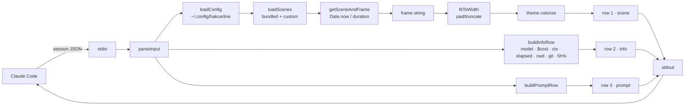
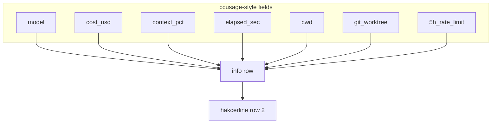
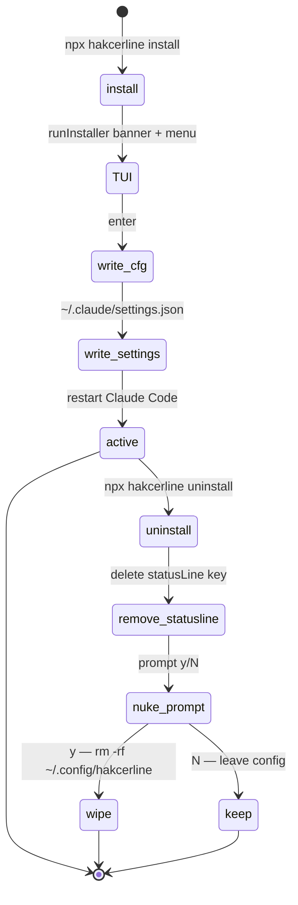

```
 ▓▓▓▓▓▓▓▓▓▓▓▓▓▓▓▓▓▓▓▓▓▓▓▓▓▓▓▓▓▓▓▓▓▓▓▓▓▓▓▓▓▓▓▓▓▓▓▓▓▓▓▓▓▓▓▓▓▓▓▓▓▓▓▓▓▓▓▓▓▓▓▓▓▓▓▓▓▓▓▓▓▓▓▓▓▓▓▓▓▓▓▓▓▓▓▓▓▓▓▓▓▓▓▓▓▓
 ▓                                                                                                           ▓
 ▓     h a k c e r l i n e   //   animated statusline for Claude Code · v0.1.0 · release: 2026-04-16         ▓
 ▓     47 themed scenes · 5 packs · 0 runtime deps · render in <10ms · state = wall clock                    ▓
 ▓                                                                                                           ▓
 ▓▓▓▓▓▓▓▓▓▓▓▓▓▓▓▓▓▓▓▓▓▓▓▓▓▓▓▓▓▓▓▓▓▓▓▓▓▓▓▓▓▓▓▓▓▓▓▓▓▓▓▓▓▓▓▓▓▓▓▓▓▓▓▓▓▓▓▓▓▓▓▓▓▓▓▓▓▓▓▓▓▓▓▓▓▓▓▓▓▓▓▓▓▓▓▓▓▓▓▓▓▓▓▓▓▓
```

# hakcerline


[](https://www.npmjs.com/package/hakcerline)
[](https://www.npmjs.com/package/hakcerline)
[](https://nodejs.org)
[](LICENSE)
[](https://github.com/haKC-ai/hakcerline)
[](https://github.com/haKC-ai/hakcerline/issues)
[](https://docs.anthropic.com/claude/docs/claude-code)
[](https://www.npmjs.com/package/ccusage)
[](scenes/)
[](package.json)
[](https://seckc.org)

Three-row animated statusline for **Claude Code**. Top row cycles through themed scenes — Matrix rain, WarGames, BBS login prompts, `nmap` sweeps, AOHell, DEFCON levels, Sub7, SecKC meetup nights. Middle row is your session metadata. Bottom row is the prompt.

Pre-rendered. Stateless. Reads stdin, prints three lines, exits.

---

## install

```bash
npx hakcerline install
```

No step 2.

This writes the `statusLine` block to your `~/.claude/settings.json`. Restart Claude Code and watch the top of the terminal start moving.

Remove it:
```bash
npx hakcerline uninstall
```
Removes the `statusLine` block from `~/.claude/settings.json`, then prompts before nuking `~/.config/hakcerline/` (config + custom scenes).

Inspect the scene library:
```bash
npx hakcerline list
```

---

## what you get

**Row 1** — animated scene, themed color, cycles every 30s (configurable)

**Row 2** — `model │ $cost │ context bar % │ elapsed │ cwd │ worktree │ 5h rate%`

**Row 3** — session name or `hakcerline`

Every render: read stdin, derive frame from `Date.now()`, print, exit. No daemon. No background process. No npm deps at runtime.

---

## the 47 scenes

| pack | count | what's in it |
|---|---|---|
| `core` | 7 | matrix_rain · wargames · nmap_sweep · bbs_login · packet_race · jp_fence · hacker_typer |
| `infosec` | 10 | traceroute · wardialer · sine_scroller · irc_channel · hexdump · ssh_brute · dns_exfil · enigma · defcon_level · metasploit |
| `oldschool` | 10 | blue_box · warez_nfo · l0phtcrack · morris_worm · cdc_bo · phrack · red_box · sub7 · manifesto · mitnick |
| `aol` | 10 | aohell · aol_chatroom · lord · tradewars · mud_session · icq · aim · napster · mirc_xdcc · winnuke |
| `seckc` | 10 | meetup_night · schedule · cyberraid0 · badge_pirates · seckcoin · discord · venue_history · talks · rexkc · stitches |

---

## testimonials (totally real)

> "Finally a statusline that understands me. I pressed Enter and a blue box played a 2600Hz tone. My phreak ancestors wept."
> — `anon`, somewhere with a payphone

> "The DEFCON scene cycled to DEFCON 1 during a prod incident. Spooky. Shipped the fix anyway."
> — SRE, regrets nothing

> "My intern thought `hakcerline` was an exploit kit. I let them think that."
> — red team lead

> "Works on my BBS."
> — sysop, WWIV user

---

## config

Optional. `~/.config/hakcerline/config.json`:

```json
{
  "packs": ["all"],
  "duration": 30,
  "theme": "matrix",
  "customScenesDir": "~/.config/hakcerline/scenes",
  "exclude": [],
  "only": null
}
```

| field | default | what it does |
|---|---|---|
| `packs` | `["all"]` | `core`, `infosec`, `oldschool`, `aol`, `seckc`, `all` |
| `duration` | `30` | seconds per scene before cycling |
| `theme` | `matrix` | row 1 color: `matrix`, `amber`, `green`, `ice`, `kali`, `seckc` |
| `customScenesDir` | `null` | extra directory with your own scene JSONs |
| `exclude` | `[]` | scene IDs to skip |
| `only` | `null` | if set, only run these scene IDs |

### themes

| theme | color | vibe |
|---|---|---|
| `matrix` | `#00ff41` | default · green terminal |
| `amber` | `#ffb000` | CRT phosphor |
| `green` | `#33ff33` | P1 phosphor |
| `ice` | `#00bcd4` | cold blue recon |
| `kali` | `#bb9af7` | purple · offensive |
| `seckc` | `#ff6b35` | SecKC orange |

---

## custom scenes

Drop JSON files in `~/.config/hakcerline/scenes/`. They join rotation automatically.

```json
{
  "id": "custom_my_corp",
  "name": "My Corp",
  "pack": "custom",
  "frames": [
    " ACME Corp | Jenkins: 47 passing | Prod: healthy | On-call: nobody (good luck)",
    " ACME Corp | Jenkins: 46 passing 1 FAILING | Prod: DEGRADED | On-call: you (lol)"
  ]
}
```

Frames are pre-rendered strings, ~120 chars wide, any length array. Runtime pads/truncates to your terminal width. No code changes, no rebuilds.

---

## how it works

1. Claude Code calls `hakcerline` every render tick
2. stdin = session JSON (model, cost, context %, cwd, worktree, rate limits — same shape [`ccusage`](https://www.npmjs.com/package/ccusage) reads)
3. pick scene + frame from wall clock: `Math.floor(Date.now()/1000/duration) % N`
4. pick frame index: `Math.floor(elapsed * 12.5)`
5. pad/truncate to terminal width
6. colorize, build info row, build prompt row
7. print three lines, exit

Two invocations 80ms apart read sequential frames. The clock is the state.



### data the info row borrows



### install/uninstall flow



---

## prior art & acks

- **[`ccusage`](https://www.npmjs.com/package/ccusage)** — the Claude Code cost/rate tracker. The info row reads the same stdin JSON shape `ccusage` exposes (model, cost, context %, elapsed, worktree, 5h rate). If you want numbers without scenery, use `ccusage` directly.
- **[`terminaltexteffects`](https://pypi.org/project/terminaltexteffects/)** — the TTE pip module powering the installer's decrypt intro. Gallery of 30 TTE effects applied to the `hakcerline` banner lives in [`assets/animated/`](assets/animated/).
- **`hakcer`** — the terminal ASCII bling pip module that inspired this one. Different surface area, same spirit.

---

## license

MIT. Use it. Fork it. Ship custom scene packs for your company's on-call dashboard. Send them back as a PR if they're good.

---

## GREETZ

SecKC · Badge Pirates · 2600Hz crew · every sysop who ever kicked a lamer for asking `/who` twice · PHRACK · CCC · the ghost of `bo2k` · everyone still typing at 300 baud in their heart

```
   ▀▄ GREETZ also go out to /dev/null, which never said a word but listened every time ▄▀
```
